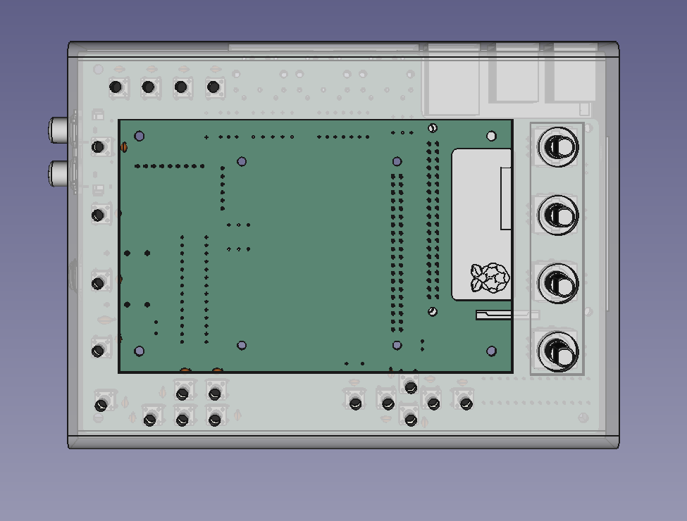
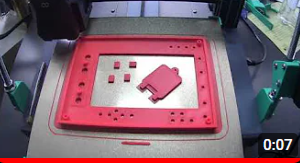

This repo include design details for 3d printable Case for Zynthian MINI V2 synthisizer. 

Zynthian Case is designed usign FreeCAD or its equivalent Ondsel software. 

For more infromation about what zynthian mini V2 is and how to assemble go to [wiki](https://github.com/sstojos/zynthian-mini/wiki) page. 

[)](https://youtu.be/5RSKHbG7Gxg)
